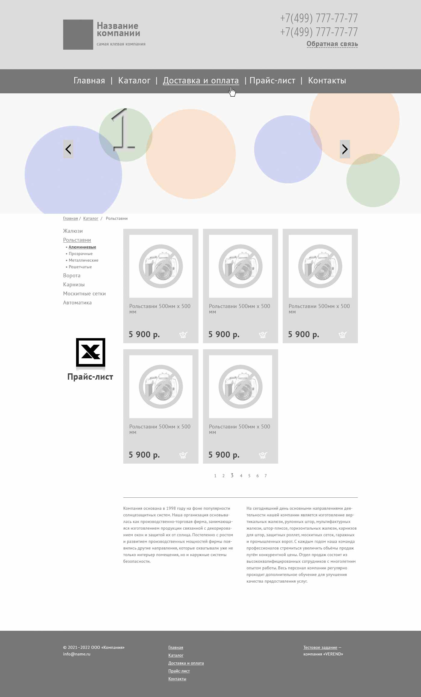
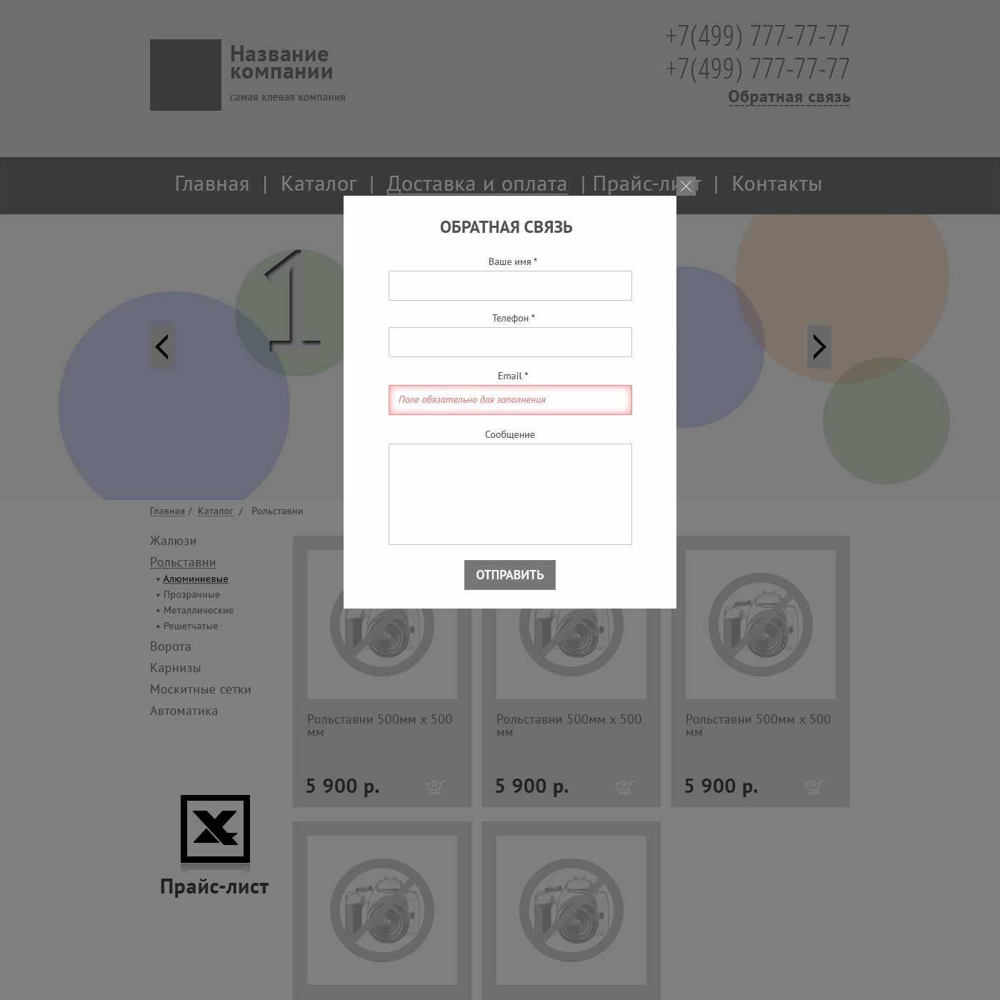

Тестовое задание по HTML/CSS. Сверстать страницу по макетам.

# Использовано

Чистые HTML и CSS. Bootstrap для реализации слайдера и модального окна.

# ТЗ

1. Слайдер должен тянуться на всю ширину экрана, при этом изображение внутри блока должно быть по центру. Изображение должны скрываться, если его ширина больше окна браузера (не должно растягивать верстку) и должно быть по центру, если его ширина меньше окна браузера. Смена картинок слайдера происходит каждые 4 секунды с fade-эффектом.
1. Изменение размеров и/или удаление одного из блоков области header не должно влиять на другой блок.
1. Основное навигационное меню (область menu) и меню в области footer должны быть сверстаны в виде стилизованных списков.
1. Форма обратной связи появляется с fade-эффектом по клику на ссылку «обратная связь» в шапке сайта. Окно и поля, заполненные с ошибкой, должны быть стилизованы в соответствии с макетом.